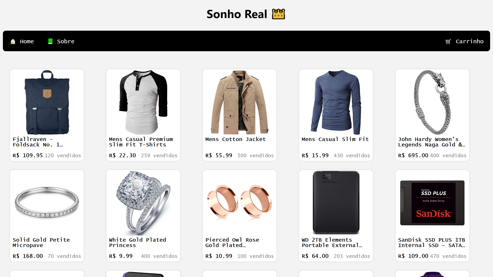

# SonhoRealStore

## Uma simples loja demo feita em AstroJS com fins de treinamento

Mais detalhes em [Sobre](https://sonhorealstore.vercel.app/about).

## Ajude-nos, a melhorar o site 🤩❤️

FEITO POR [LucasATS](https://github.com/LucasATS)
INSPIRADO EM COISAS ALEATÓRIAS DA MINHA MENTE.
ELEMENTOS FORAM EXTRAIDOS DE [fake store api](https://fakestoreapi.com/) e [AstroJS tutorial](https://docs.astro.build/pt-br/tutorial/).

[🔗 ACESSE O PROJETO](https://sonhorealstore.vercel.app/)

## __📂 PLAY__

Necessario tem NodeJS v20.11.0

  cd FRONTEND

> gitclone:

    git clone https://github.com/LucasATS/SonhoRealStore.git

> Install:

    npm install

    npx astro add vercel

> start

    npm run dev

## __🎯 METAS__

- Layout
  - [X] Menu de navegação superior
  - [X] Criar um footer

- Home (Tela store)
  - [X] Itens da loja

- Página de detalhes do produto
  - [X] Adicionar produto ao carrinho
  - [X] Adicionar itens relacionados

- Modal carrinho
  - [X] Listar produtos
  - [X] Criar componente dos produtos
  - [X] Alterar quantidade e valor do produto
  - [X] Abrir e fechar modal via comando
  - [X] Atualizar lista sempre que adicionar um novo item
  - [X] Fazer a lista ficar no sentido decrescente
  - [X] Remover produto do carrinho
  - [ ] Corrigir o bug de quantidade de itens adicionado

- Tela de About
  - [X] Adicionar um .md explicando sobre o projeto

- SEO
  - [ ] SEO estático
  - [ ] SEO dinamico para tela de produtos

- Responsividade
  - [X] Suporte para mobile
  - [X] Suporte para diferentes tamanhos de telas

<!--
## __❤ AGRADECIMENTOS__
[@<NOME>](<LINK>) "<MENSAGEM>"
-->

## __🛠 TECNOLOGIAS__

## __😘 CONTATO__ <ALTERE APENAS OS LINKS DOS HREF>

  
  
  

